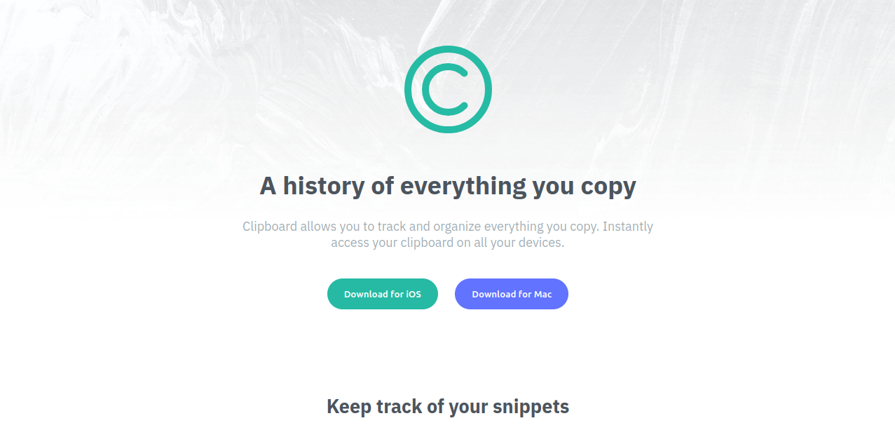
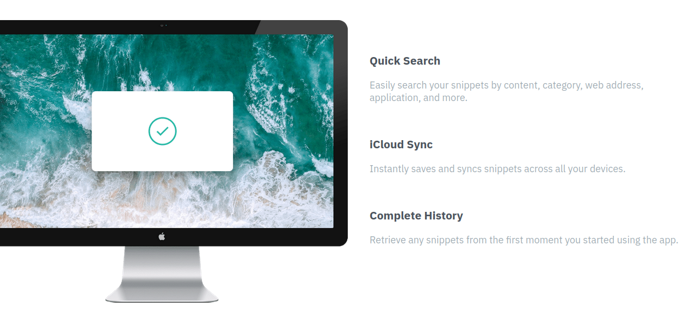
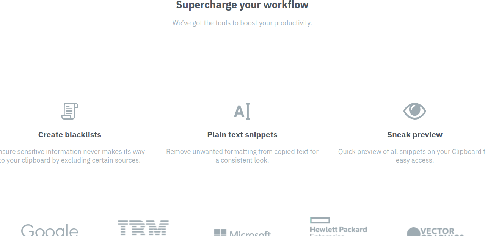
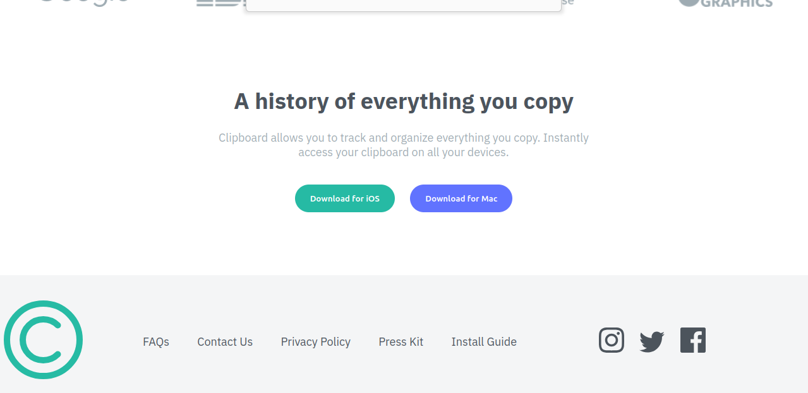

# Clipboard Landing Page 📋

Solución al reto [clipboard-landing-page](https://www.frontendmentor.io/challenges/clipboard-landing-page-5cc9bccd6c4c91111378ecb9) de Frontend Mentor.

## 🔗 Links

- 🌐 Demo en vivo: [GitHub Pages](https://o0vanfanel0o.github.io/clipboard-page/)
- 💻 Repositorio: [GitHub](https://github.com/o0VanFanel0o/clipboard-page)

## 📸 Vista previa

## 🛠️ Tecnologías

- HTML5 semántico
- CSS3 — Flexbox, diseño responsivo desktop y móvil
- CSS separado por breakpoints — `style.css` y `desktop.css`

## 🎯 Lo que aprendí

- Crear landing pages completas con secciones múltiples
- Manejar imágenes responsivas con backgrounds diferentes para mobile y desktop
- Integrar logos de marcas y redes sociales con SVGs
- Separar estilos mobile-first en archivos CSS independientes

## 👤 Autor

- GitHub: [@o0VanFanel0o](https://github.com/o0VanFanel0o)
